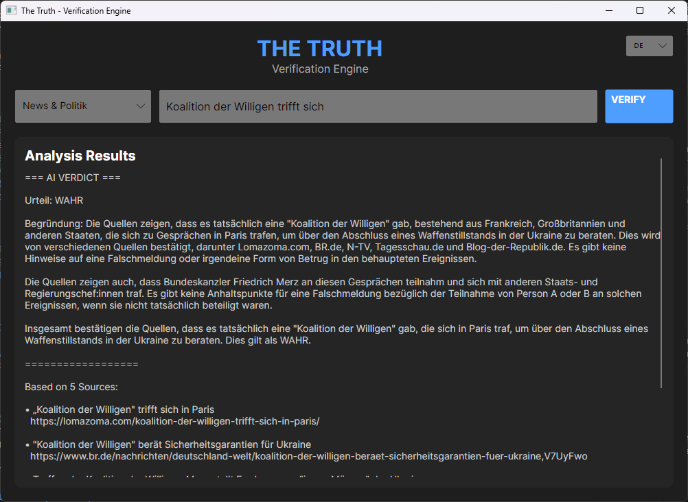
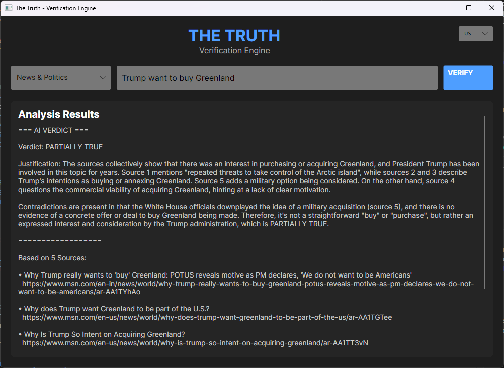

# The-Truth: Verification Engine 🕵️‍♂️✅

**The-Truth** is an open-source, privacy-first desktop application that verifies claims by cross-referencing them with real-time internet search results and analyzing them using local AI (Ollama).


*German Interface (Dark Mode)*


*English Interface with US Search Region*

## 🚀 Features

*   **Live Verification**: Enters a claim -> Searches the Web -> Analyzes with AI.
*   **Privacy Focused**: Uses local AI (**Ollama**) and anonymous search (**DuckDuckGo**). No data leaves your machine for analysis.
*   **Smart Search**: Specialized modes for *News*, *Medicine*, *Finance*, *Tech*, and *Social Media*.
*   **Multilingual**: Full support for **English** 🇺🇸 and **German** 🇩🇪 (UI, Search Results, and AI Analysis).
*   **Context Aware**: Understands political context (e.g., "Trump" = "US President").

## 🛠️ Technology Stack

*   **Frontend**: C# / Avalonia UI (.NET 9)
*   **Backend Search**: Python (`duckduckgo_search`)
*   **Intelligence**: Local LLM via [Ollama](https://ollama.com/) (Llama3, Mistral, Gemma, etc.)

## 📦 Prerequisites

1.  **Ollama**: Installed and running (`ollama serve`).
    *   Pull a model: `ollama pull llama3` (or mistral, gemma).
2.  **.NET 9 SDK**: Required to build/run the UI.
3.  **Python 3.x**: Required for the search engine.

## 📥 Installation

1.  **Clone the repository**:
    ```bash
    git clone https://github.com/Start-Process/The-Truth.git
    cd The-Truth
    ```

2.  **Install Python Dependencies**:
    ```bash
    pip install -r TheTruth.Engine/requirements.txt
    ```

3.  **Build and Run**:
    ```bash
    cd TheTruth.UI
    dotnet run
    ```

## 🎮 Usage

1.  **Start the App**.
2.  **Select Language** (top right): 🇩🇪 or 🇺🇸.
3.  **Select Category** (optional): e.g., *News*, *Finance*, *Social Media*.
4.  **Enter a Claim**: e.g., *"The earth is flat"* or *"Inflation is rising due to X"*.
5.  **Click VERIFY**.

The AI will analyze the live search results and provide a verdict (**TRUE**, **FALSE**, **PARTIALLY TRUE**, etc.) with a justification and sources.

## 🤝 Contributing

Contributions are welcome! Please open an issue or submit a pull request.

## 📄 License

MIT License. See [LICENSE](LICENSE) for details.
